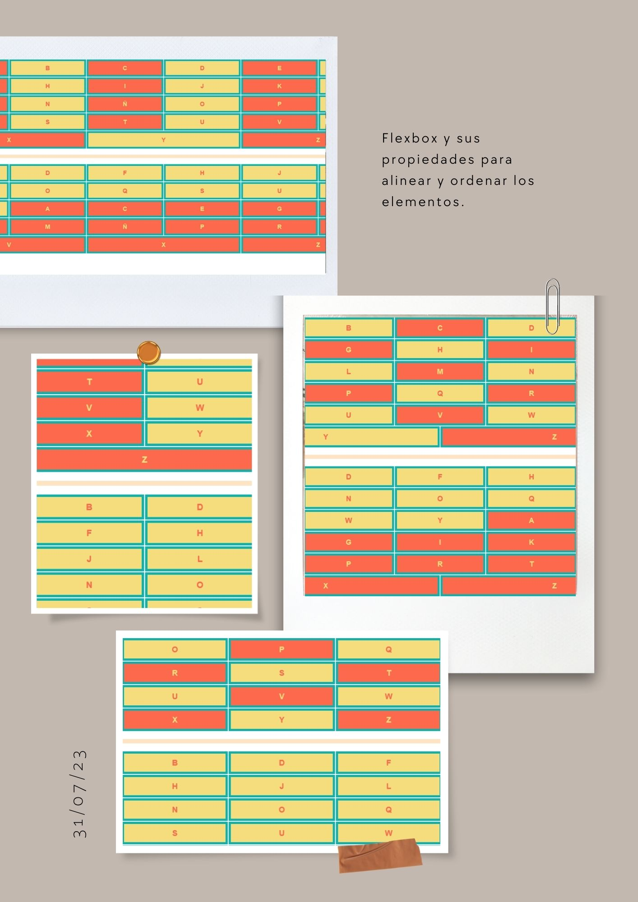

# Práctica utilizando CSS FLEXBOX 

*En esta práctica se utilizó el módulo* `flexbox` *para alinear elementos.* :shipit: :seedling: :mushroom:
*Las propiedades utilizadas son:*
```
justify-content
align-items
flex
flex-wrap
gap
order
```

