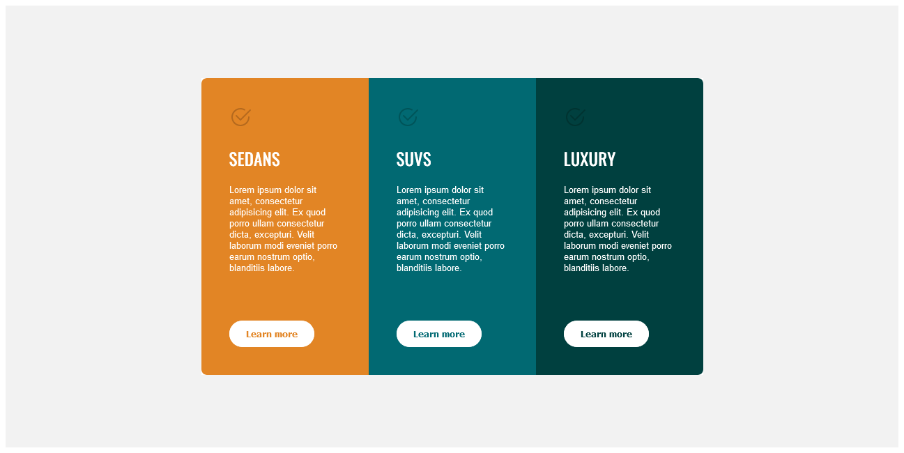

# Práctica utilizando CSS FLEXBOX

*En esta práctica se utilizó el módulo* `Flexbox` *para alinear elementos.* :paw_prints: :shipit:

En el link está el archivo original [Carros](https://res.cloudinary.com/dz209s6jk/image/upload/v1617293350/Challenges/ofrkupd8a9wh1wenvr8c.jpg).